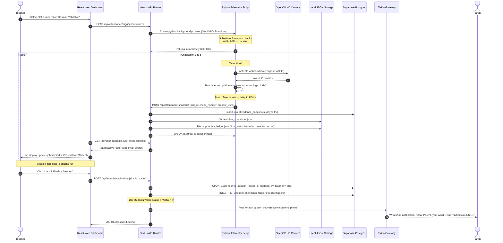
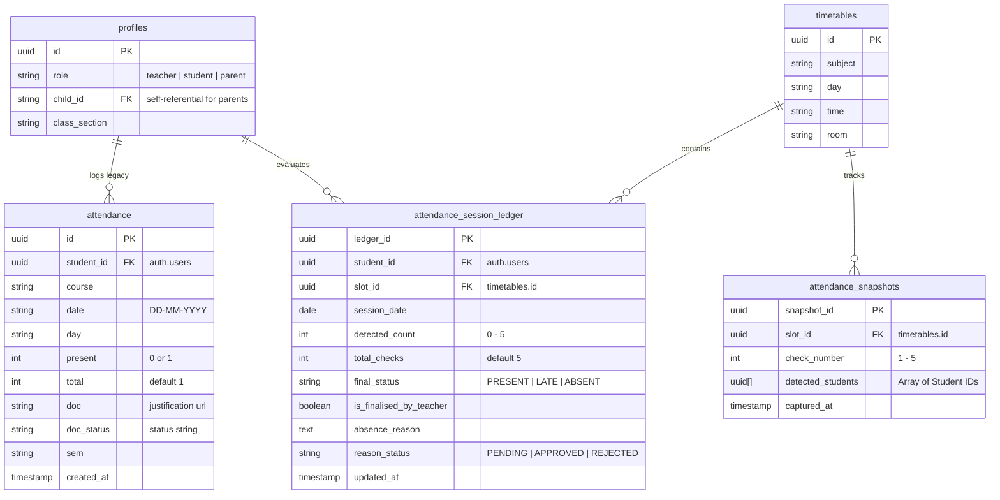

# Connect & Prep: Face-Recognition & IoT Mesh Attendance Architecture

This document specifies the system architecture, hardware-software topologies, and data-flow pipelines for the automated **Face-Recognition & IoT Mesh Attendance System** integrated into the **Connect & Prep** campus management platform.

---

## 1. System Topology Overview

The attendance system uses a hybrid model comprising **Edge AI Cameras**, a **Wireless ESP32 Mesh Grid** for physical signaling/lighting automation, a **Next.js 14 Web Portal**, and a database tier backed by **Supabase PostgreSQL** (with an autonomous local JSON fallback).

```mermaid
flowchart TB
    subgraph EdgeDevices ["1. Edge & IoT Layer"]
        Camera["📹 OpenCV HD Camera Node"]
        ESP_Gateway["🔌 ESP32 Gateway Node (USB-Serial)"]
        ESP_Mesh1["📡 ESP32 Mesh Node A (Relay Q1-Q2)"]
        ESP_Mesh2["📡 ESP32 Mesh Node B (Relay Q3-Q4)"]
    end

    subgraph BackendTier ["2. Application & API Routing"]
        API_Route["💻 Next.js API Routes (Serverless)"]
        LocalFiles["💾 Local JSON Datastore (live_snapshots.json & live_ledger.json)"]
    end

    subgraph DatabaseTier ["3. Cloud Infrastructure & Alerts"]
        SupaDB[("🗄️ Supabase PostgreSQL DB")]
        TwilioWhatsApp["💬 Twilio API (WhatsApp Parent Alerts)"]
    end

    subgraph Clients ["4. Client Application Dashboards"]
        TeacherConsole["👨‍🏫 Teacher Portal (Real-time Roster)"]
        StudentPortal["🎓 Student Portal (Excuses & Stats)"]
        ParentPortal["👪 Parent Portal (Real-time Gate Check-in)"]
    end

    %% Connections
    Camera -->|1. Detects & Decodes Faces| Camera
    Camera -->|2. POST telemetry/snapshot| API_Route
    Camera -->|3. Serial: quads state json| ESP_Gateway
    
    ESP_Gateway -->|painlessMesh: broadcast| ESP_Mesh1 & ESP_Mesh2
    ESP_Mesh1 & ESP_Mesh2 -->|Toggle Relays| Lights["💡 Zone Lighting Relays"]
    
    API_Route -->|4a. Try Sync| SupaDB
    API_Route -->|4b. Write Fallback| LocalFiles
    
    TeacherConsole -->|Fetch Live Status| API_Route
    StudentPortal -->|File Excuse| API_Route
    
    SupaDB -->|Real-time pg_changes| TeacherConsole
    API_Route -->|5. Trigger Twilio (WhatsApp)| TwilioWhatsApp
```

---

## 2. Core Technology Stack

| Layer / Component | Technology | Description |
| :--- | :--- | :--- |
| **Edge AI & Vision** | Python 3.10+, OpenCV (`cv2`), `face_recognition` (dlib HOG model) | Captures live camera frames, matches face encodings, maps recognized names to USNs. |
| **IoT Mesh Grid** | ESP32-WROOM-32D, Arduino C++, `painlessMesh`, `ArduinoJson` | Standardizes mesh nodes on Port 5555, drives physical relays (Active-Low) over GPIO pins. |
| **Web Server & Backend** | Next.js 14+ (App Router), TypeScript, Vercel Serverless | Exposes CORS-enabled API routes for snapshot handling, list fetching, data purging, and ledger finalizing. |
| **Database & Realtime** | Supabase (PostgreSQL 15), Supabase Realtime Channels | Maintains the session state ledger, user profiles, legacy records, and notifies clients via `postgres_changes`. |
| **Notification Services** | Twilio API (WhatsApp Business API) | Automatically dispatches WhatsApp alert messages to parents when a student is marked ABSENT. |
| **Frontend Framework** | React 19, Vanilla CSS, Context API (`AuthContext`), Lucide Icons | Renders role-based teacher consoles (real-time telemetry) and student portal views (attendance calendar, excuse submissions). |
| **Data Fallback System** | Local JSON Store (`live_snapshots.json`, `live_ledger.json`) | Restores system functionality even if the Supabase database instance is offline or unreachable. |

---

## 3. Detailed Data-Flow & Lifecycle

The attendance verification lifecycle runs through **5 distinct checkpoints** distributed dynamically throughout the duration of a scheduled lecture.

### Telemetry Pipeline Sequence


---

## 4. Subsystem Architectures

### A. Edge AI Face Recognition Pipeline
1. **Enrollment & Dataset:** Student face captures are saved inside `dataset/[student_name]/` and compiled into HOG (Histogram of Oriented Gradients) encodings by `train_model.py`, creating `trainer/encodings.pickle`.
2. **Detection & Comparison:** The camera component opens and captures frames at a downscaled rate ($0.25\times$ resolution) to preserve CPU cycles on thin edges. The facial landmarks are fed into `face_recognition.compare_faces` against the pickled training representations using a strict `tolerance = 0.5` configuration.
3. **Accuracy Resolver:** 
   $$\text{Accuracy (\%)} = \max\left(0, (1.0 - \text{face\_distance}) \times 100\right)$$
4. **USN Translation Mapping:** 
   - Recognized name substrings match database USNs using a local lookup table (e.g., `bharath` $\rightarrow$ `032`, `ananya` $\rightarrow$ `012`, `riddhi` $\rightarrow$ `099`).

### B. IoT Mesh Grid Lighting Controller
*   **Dual-purpose Camera Utilization:** During surveillance/tracking, the webcam is mapped to `mesh_tracking.py` to divide the visual frame into a $2\times2$ quadrant matrix (Q1, Q2, Q3, Q4).
*   **Relay Automation Logic:** When a person walks into a quadrant zone, a serial JSON package is sent to the ESP32 Gateway Node:
    ```json
    {"quads": {"Q1": 0, "Q2": 1, "Q3": 1, "Q4": 1}}
    ```
    *(Note: 0 indicates active zone / Relay ON; 1 indicates empty zone / Relay OFF)*
*   **Wireless Mesh Relay:** The ESP32 Gateway Node switches its physical GPIO relay pins and broadcasts the JSON packet over a dedicated wireless Wi-Fi mesh network (`CampusOSMesh`, Port `5555`) via `painlessMesh`. Remote nodes listen and update local relays immediately, providing auto-lighting coordinates.

---

## 5. Database Schema & Tables

Three distinct tables support real-time attendance, tracking checks, and justification lifecycles.



### Table Definitions & Keys
1.  **`attendance_snapshots`**: Stores telemetry logs from python checkpoints.
    - Unique ID: `snapshot_id` (UUID)
    - Array Field: `detected_students` (`uuid[]`) contains list of detected users.
2.  **`attendance_session_ledger`**: Evaluates detection compliance ratios.
    - Unique Index: `(student_id, slot_id, session_date)` (prevents duplicate entries per lecture).
    - Status Rules:
      - $\text{Detections} \geq 4 \rightarrow$ **PRESENT**
      - $1 \leq \text{Detections} \leq 3 \rightarrow$ **LATE**
      - $\text{Detections} = 0 \rightarrow$ **ABSENT**
3.  **`attendance`**: Legacy production table. Enabled with Supabase Realtime replication to feed parent/student charts natively.

---

## 6. Next.js API Routes (Serverless Endpoints)

### `POST /api/attendance/trigger-randomizer`
*   **Purpose:** Spawns a background Python script to run automated checks.
*   **Payload:**
    ```json
    {
      "slot_id": "00000000-0000-0000-0000-000000000002",
      "duration": 60,
      "teacher_id": "uuid-string"
    }
    ```
*   **Behavior:** Locates Python venv executable (`/Facerecognition/venv/bin/python`), spawns a detached child process, and calls `child.unref()` to avoid blocking server responses.

### `POST /api/attendance/snapshot`
*   **Purpose:** Processes a checkpoint capture from the camera.
*   **Payload:**
    ```json
    {
      "slot_id": "slot-uuid",
      "check_number": 3,
      "present_usns": ["032", "008"],
      "teacher_id": "teacher-uuid"
    }
    ```
*   **Behavior:** Converts incoming USNs to UUIDs. Attempts to write to Supabase. Write fails? Automatically saves to `Facerecognition/live_snapshots.json`. Recalculates the ledger, writing changes to `Facerecognition/live_ledger.json`.

### `GET /api/attendance/list`
*   **Purpose:** Delivers live roster, checkmarks, percentages, and excuse files.
*   **Query Params:** `slot_id=uuid`
*   **Behavior:** Reads `live_ledger.json` (merged with default database rosters) and sorts the return payload (PRESENT first, LATE second, ABSENT last).

### `POST /api/attendance/purge`
*   **Purpose:** Clears local JSON caches for fresh webcam/simulated check runs.
*   **Behavior:** Deletes `live_snapshots.json` and `live_ledger.json`.

### `POST /api/attendance/finalise`
*   **Purpose:** Locks attendance records and launches parent notifications.
*   **Payload:**
    ```json
    {
      "slot_id": "slot-uuid",
      "roster": [...]
    }
    ```
*   **Behavior:** Updates Supabase ledger records (`is_finalised_by_teacher = true`). Compiles and inserts legacy records into `attendance` table. Initiates a POST call to Twilio Whatsapp gateway for absent students.

---

## 7. Interactive Frontend Workflow

### Teacher Console UI Dashboard
- **Controls:** Features "Start Session Validation" and "Lock & Finalise" buttons. Includes interactive dropdown fields to pick Curriculum, Term (Semester), Section, and Class Slot.
- **Dynamic Ledger Grid:** Lists students alongside their branch, section, check count (e.g., `4/5`), cumulative percentage progress, and status pills.
- **Webcam Progress Bar:** Displays check indices (`Checkpoint 1`, `Checkpoint 2`...) in real time. Shows a live simulation tracker panel when running in mock modes.
- **📋 Session Summary Card:** Activates once 5 checks conclude, listing present students and absentees in distinct side-by-side grids. Allows status overrides (clicking statuses cycles: `ABSENT` $\rightarrow$ `PRESENT` $\rightarrow$ `LATE`).
- **Justification Resolver:** Lets teachers review, approve, or reject justifications submitted by absent students.

### Student Portal View
- **Ledger List:** Displays dates, times, rooms, subjects, check counts, and finalized statuses.
- **Justification Submission:** Provides an text entry panel for ABSENT entries to file a excuse reason (which triggers state updates inside `attendance_session_ledger` via `/api/attendance/file-excuse`).

---

## 8. Directory Architecture Layout

```bash
one-campus/
├── Facerecognition/
│   ├── trainer/
│   │   └── encodings.pickle      # Compiled student face vector data
│   ├── dataset/                  # Folders with raw facial capture frames
│   ├── venv/                     # Python 3 virtual environment
│   ├── capture_faces.py          # Script to record raw student faces
│   ├── train_model.py            # Generates pickelled vector values
│   ├── recognize.py              # Single webcam window checking script
│   ├── attendance_randomizer.py  # Spawns webcam for 5 randomized checks
│   ├── mesh_tracking.py          # Quadrant tracking script sending serial packets
│   ├── esp32_mesh_node.ino       # PainlessMesh & relay automation firmware
│   ├── live_snapshots.json       # Fallback database for live snapshots
│   └── live_ledger.json          # Fallback database for computed statuses
├── src/
│   ├── app/
│   │   └── api/
│   │       └── attendance/
│   │           ├── trigger-randomizer/route.ts
│   │           ├── snapshot/route.ts
│   │           ├── list/route.ts
│   │           ├── purge/route.ts
│   │           └── finalise/route.ts
│   └── components/
│       └── features/
│           ├── Attendance.jsx    # React dashboard interface components
│           └── Attendance.css    # Premium CSS for layout structures
```
