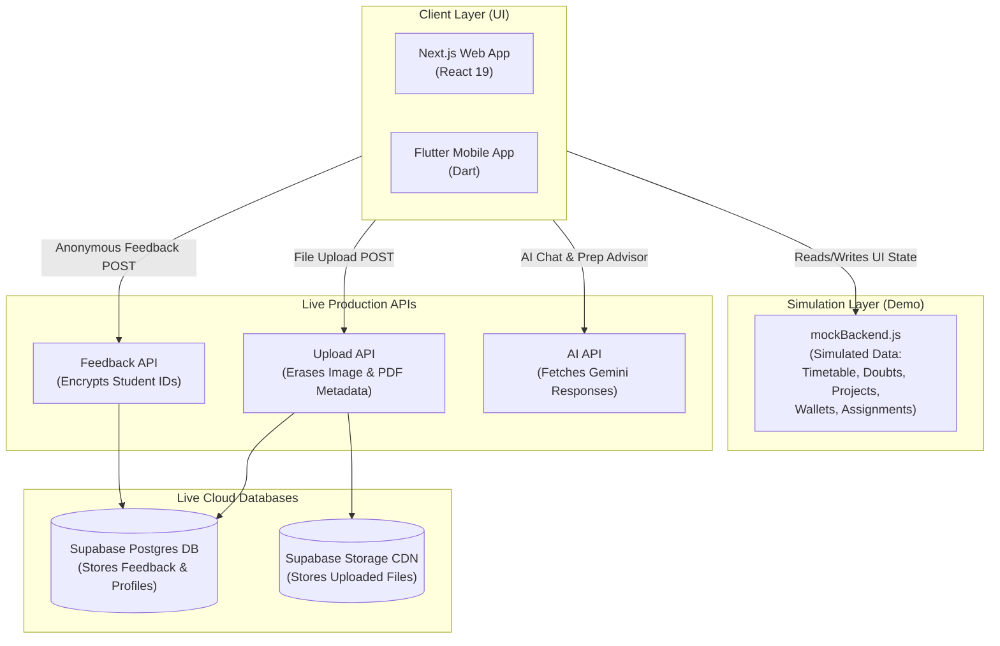

# 🏆 Connect & Prep
### *The Ultimate AI-Powered Academic Command Center & Campus Portal*

<p align="center">
  
</p>

<p align="center">
  <a href="https://nextjs.org"></a>
  <a href="https://flutter.dev"></a>
  <a href="https://supabase.com"></a>
  <a href="https://ai.google.dev"></a>
</p>

---

## 💎 The Vision

**Connect & Prep** is a premium, high-performance academic hub and campus command center. It bridges the gap between fragmented study resources, team coordination, and student safety while maintaining strict privacy standards. Built with a sleek dark-mode aesthetic, it consolidates student portals, parents' views, teachers' diaries, and AI mentoring engines into a single responsive node.

---

## 🏆 Awards & Recognition

> [!TIP]
> **2nd Place Winner** at the State Level Hackathon *Parivarthan* (Vidyavardhaka College of Engineering). Recognized for outstanding UI/UX design, structural database integrity, and architectural stability.

---

## ⚡ Key Core Pillars

### 🧠 1. AI Intelligence Node (Google Gemini 1.5 Flash)
*   **Prepcare Study Advisor:** Analyzes student CGPA and strengths to generate interactive, custom roadmap checklists.
*   **Bloom's Taxonomy Exam Builder:** Allows faculty to generate tailored exam question sheets on-the-fly with adjustable cognitive sliders.
*   **Smart Doubt Tagging:** Automatically categorizes forum queries, runs semantic search over study notes, and drafts tutor replies.

### 🛡️ 2. Cybersecurity & Privacy Hardening
*   **DPDP Act-Compliant Feedback:** Uses daily rotating cryptographic HMAC-SHA256 tokens to decouple student IDs from reviews, allowing rate-limited feedback without identity tracking.
*   **Metadata Stripper Gate:** Wipes GPS location markers from uploaded images (using `sharp`) and scrubs author names from PDFs (using `pdf-lib`) before uploading to a secure CDN.
*   **Zero-Trust Session Gating:** Authentication is locked behind secure `HttpOnly` cookie stores and server-side `getUser()` checks to prevent script-hijacking.

### 📊 3. Consolidated Campus Dashboards
*   **Students:** Check-in calendars, assignment vaults, CGPA calculators, library directories, and study marathons.
*   **Teachers:** Classroom booking logs, syllabus timelines, manual attendance registration, and counseling logs.
*   **Parents:** Direct insight into child attendance percentages, CGPA trends, and real-time gate entry/exit alerts.

---

## 🗺️ Architectural Topology

For a complete breakdown of what is simulated locally vs. what runs on live production cloud servers, view our detailed architecture log: [newarch.md](file:///Users/bharathkumara/Desktop/PROJECTS/one-campus/newarch.md)



---

## 🔑 Demo Access Credentials

To test specific user portals and layouts in offline simulation mode, use these credentials on the login screen:

| Role | Email | Password | Details |
| :--- | :--- | :--- | :--- |
| **Student** | `1` | `1` | Default student dashboard view |
| **Teacher** | `2` | `2` | Teacher console & classroom manager |
| **Parent** | `3` | `3` | Parent dashboard with child statistics |
| **Admin** | `admin` | `admin` | Full system administrator panel |

For targeted VVCE database profiles:
*   **Bharath Kumar A (Student):** `bk@vvce` (Password: `bk`)
*   **Bhavana (Teacher):** `bhav@vvce` (Password: `bhav`)
*   **Abhi (Parent of Ananya):** `abhi@vvce` (Password: `abhi`)

---

## 🚀 Getting Started

### 1. Initialize Project Repository
```bash
git clone https://github.com/bharathkumar000/cp.git
cd cp
```

### 2. Install Dependencies
```bash
npm install
```

### 3. Setup Your Environment (.env)
Create a `.env` file in the root directory and configure your keys:
```bash
# Supabase Database Settings
NEXT_PUBLIC_SUPABASE_URL=https://your-project-id.supabase.co
NEXT_PUBLIC_SUPABASE_ANON_KEY=your_anonymous_key

# Supabase Local Mock Toggle
NEXT_PUBLIC_USE_MOCK_SUPABASE=true

# Google Gemini API
GEMINI_API_KEY=your_gemini_key
```

> [!NOTE]
> Setting `NEXT_PUBLIC_USE_MOCK_SUPABASE=true` allows you to run all front-end features in offline demo mode. Change it to `false` to redirect queries to your live cloud databases.

### 4. Database Setup
To set up your Supabase project schema:
1. Copy all code inside [complete_setup_unified.sql](file:///Users/bharathkumara/Desktop/PROJECTS/one-campus/supabase/schema/complete_setup_unified.sql).
2. Open the **SQL Editor** inside your Supabase project dashboard.
3. Paste the contents and click **Run**.

### 5. Launch the Local Dev Server
```bash
npm run dev
```

---

<div align="center">

### 👨‍💻 Developed by **Bharath Kumar A**
*Full Stack Developer | UI/UX Architect*

[](https://linkedin.com/in/bharathkumar000)
[](https://github.com/bharathkumar000)

*Crafted with precision for the global student community.*

</div>