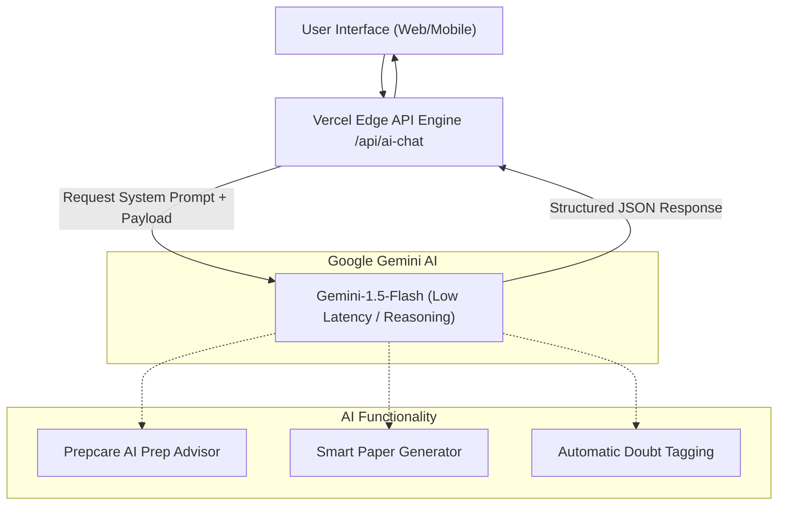

# AI Intelligence & Gemini Features Specification

This document details the architectural design, prompt models, and API integrations of the **AI Intelligence Engine** inside Connect & Prep. The features leverage Google's **Gemini AI Model Suite** to drive academic insights.

---

## 1. Feature Map Overview



---

## 2. Core Intelligent Modules

### 2.1 Prepcare AI Prep Advisor
*   **Target Audience**: Students
*   **Goal**: Provides personalized, interactive study schedules and goals based on learning styles and USN profiles.
*   **Data Inputs**: Current CGPA, study hours streak, current subject difficulty metrics, and target exam date.
*   **Sample System Instructions**:
    ```text
    You are Prepcare, an advanced academic mentor.
    Given a student's CGPA, subject list, and target score, formulate:
    1. A checklist of 3 actionable study items.
    2. A target schedule broken down by modules.
    3. Encouraging, metrics-focused guidance.
    Format your response cleanly in Markdown.
    ```

### 2.2 Smart Question Paper Generator
*   **Target Audience**: Faculty / Teachers
*   **Goal**: Automates exam creation by generating high-quality test questions mapped to the Bloom's Taxonomy cognitive levels (Remembering, Understanding, Applying, Analyzing, Evaluating, Creating).
*   **Data Inputs**:
    *   `subject`: Course name (e.g., "Digital Signal Processing")
    *   `marks`: Total score weightage (e.g., "50 Marks")
    *   `difficulty`: "Easy", "Medium", "Hard"
    *   `modules`: Core chapters included
*   **Data Flow**:
    1. Teacher fills setup parameters in Next.js web application.
    2. Form makes POST request to `/api/paper-generator/generate`.
    3. Server formats prompt requesting structured JSON output (with standard sections, schemas, and marks distribution).
    4. Gemini parses and outputs a beautiful question paper.

### 2.3 Automated Doubt Tagging & Resolving
*   **Target Audience**: Students & Tutors
*   **Goal**: Evaluates student doubts on-the-fly to assign tags and suggest instant context resources.
*   **Data Flow**:
    1. Student submits question: "Explain why B-trees are balanced."
    2. Backend triggers Gemini API to extract key tags (e.g., `["data-structures", "indexing", "databases"]`) and queries vectors or suggests local notes.
    3. Instantly provides a draft AI response for preview before faculty answers it manually.
