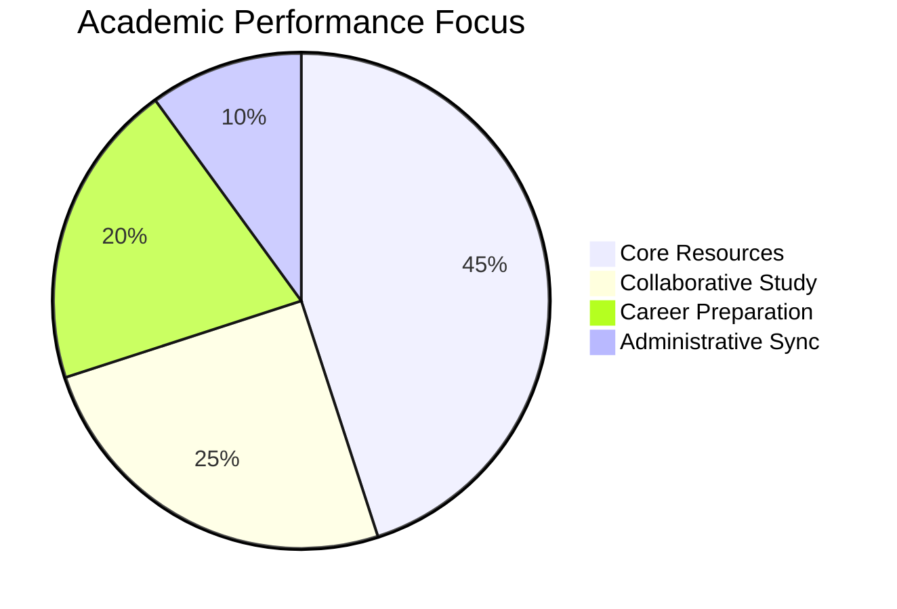

<div align="center">

# ⚡ CYBER PROTOCOL: CONNECT & PREP
### *High-Fidelity Academic Intelligence Core*


---

## 🦾 SYSTEM SPECIFICATIONS

| Parameter | Specification |
| :--- | :--- |
| **Engine** | Next.js 14.2 (App Router) |
| **Aesthetic** | Premium Dark SaaS / Cyber-Grey |
| **Identity** | Institutional Student Portal |
| **Status** | [STABLE] |

---

## 🛡️ MISSION CRITICAL MODULES

### 🧬 Academic Intelligence
- **AI Roadmap Generator**: Dynamically adapts to student performance.
- **Predictive Analytics**: SGPA/CGPA forecasting using Recharts.
- **Resource Vault**: Categorized institutional repository.

### 📡 Social Synchronization
- **Peer-to-Peer Tutoring**: Direct mentorship bridge.
- **Group Study Marathons**: Synchronized focus sessions.
- **Anonymous Feedback**: Transparent institutional reporting.

---

## ⚡ PERFORMANCE METRICS



---

## 📡 CONNECTION PROTOCOLS

```bash
# Clone Node
git clone https://github.com/your-org/connect-and-prep-college.git

# Initialize Dependencies
npm install --force

# Boot System
npm run dev
```

---

### ARCHITECT: [TEAM CONNECT & PREP]
**[STRENGTH THROUGH INTELLIGENCE]**
</div>

