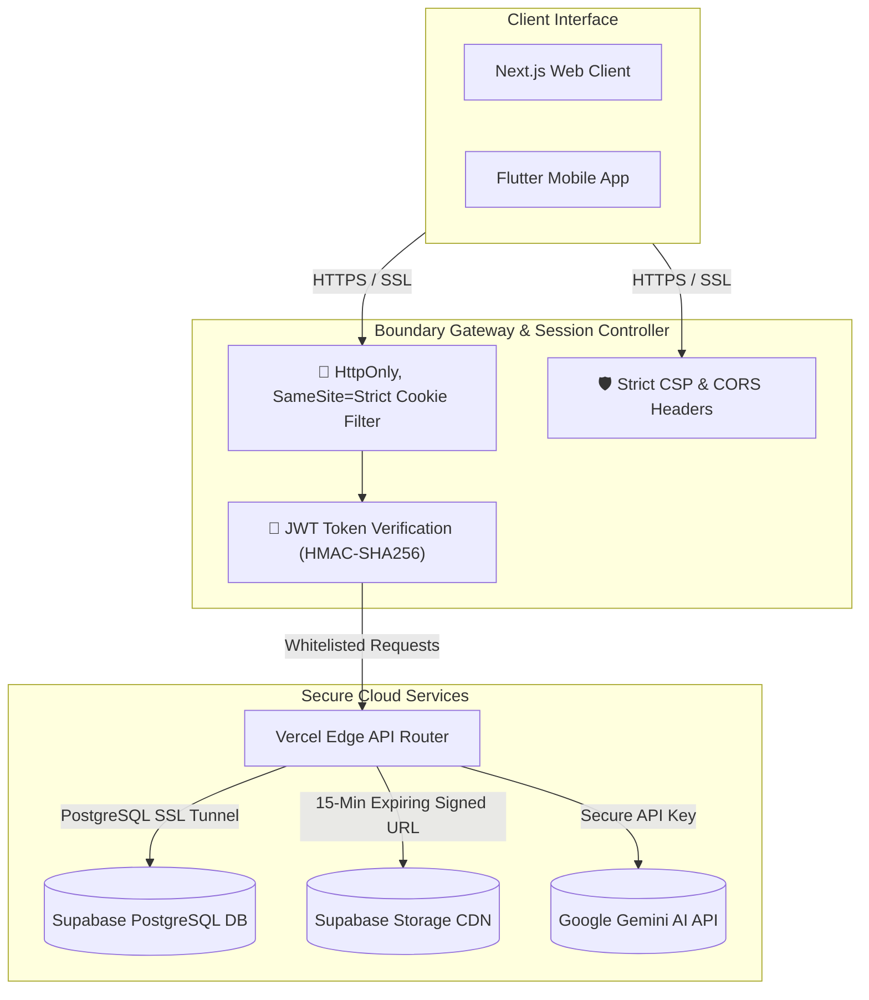

# 🛡️ Connect & Prep: Cybersecurity Deep-Dive & Architecture Specification
### *Zero-Trust Academic Governance, Data Privacy Hardening & DPDP Act 2023 Compliance*

---

## 1. Overview of Zero-Trust Security Architecture

Connect & Prep enforces a **Zero-Trust Security Architecture** across all components. Trust is never assumed based on the network layer; instead, every transaction must be explicitly authenticated, authorized, and validated.



---

## 2. Authentication Core & Session Gating

Our identity framework prevents session hijack attacks through modern cookie configurations:

### A. HttpOnly, SameSite=Strict Sessions
* **The Vulnerability:** Storing session JSON Web Tokens (JWTs) in `localStorage` makes them susceptible to extraction via Cross-Site Scripting (XSS) injection.
* **The Mitigation:** Connect & Prep blocks local storage session tracking. Tokens are issued as secure cookies:
  * `HttpOnly`: Prevents client-side JavaScript (`document.cookie`) from reading the session token.
  * `Secure`: Forces the browser to send cookies only over encrypted HTTPS connections.
  * `SameSite=Strict`: Restricts cookie transfer on cross-site requests, mitigating Cross-Site Request Forgery (CSRF).

### B. Role-Based Access Control (RBAC) Claim Gating
The application checks user roles using claims embedded inside the verified JWT payload:

```javascript
// Next.js Edge Middleware JWT Role Verification Example
import { jwtVerify } from 'jose';

export async function middleware(request) {
  const token = request.cookies.get('session_token')?.value;

  if (!token) {
    return new Response(JSON.stringify({ error: 'Authentication Required' }), { status: 401 });
  }

  try {
    const secret = new TextEncoder().encode(process.env.JWT_SECRET);
    const { payload } = await jwtVerify(token, secret);

    // Extract custom role claim from JWT
    const userRole = payload.app_metadata?.role; // 'student' | 'teacher' | 'parent' | 'admin'
    const path = request.nextUrl.pathname;

    if (path.startsWith('/dashboard/admin') && userRole !== 'admin') {
      return new Response(JSON.stringify({ error: 'Forbidden' }), { status: 403 });
    }

    if (path.startsWith('/dashboard/teachers-diary') && userRole !== 'teacher') {
      return new Response(JSON.stringify({ error: 'Access Denied' }), { status: 403 });
    }
  } catch (err) {
    return new Response(JSON.stringify({ error: 'Invalid Session Signature' }), { status: 403 });
  }
}
```

---

## 3. Database Protection & PostgreSQL Row-Level Security (RLS)

Security checks are enforced directly at the database engine level. Even if the Vercel API layer is fully compromised, the attacker cannot run cross-account queries.

### Row-Level Security (RLS) SQL Implementations

```sql
-- Enable RLS on core schemas
ALTER TABLE profiles ENABLE ROW LEVEL SECURITY;
ALTER TABLE wallet ENABLE ROW LEVEL SECURITY;
ALTER TABLE anonymous_feedback ENABLE ROW LEVEL SECURITY;

-- 1. Profiles Table Protection Policy
-- Students can read all profiles in their college but only update their own.
CREATE POLICY select_college_profiles ON profiles
    FOR SELECT TO authenticated
    USING (college_id = (SELECT college_id FROM profiles WHERE id = auth.uid()));

CREATE POLICY update_own_profile ON profiles
    FOR UPDATE TO authenticated
    USING (id = auth.uid())
    WITH CHECK (id = auth.uid());

-- 2. Wallet Table Protection Policy
-- Ensures balances can only be accessed by the matching account owner.
CREATE POLICY select_own_wallet ON wallet
    FOR SELECT TO authenticated
    USING (user_id = auth.uid());

-- 3. Anonymous Feedback Table Protection Policy
-- Students can insert feedback anonymously, but only admins can view submissions.
CREATE POLICY insert_anonymous_feedback ON anonymous_feedback
    FOR INSERT TO authenticated
    WITH CHECK (auth.uid() IS NOT NULL);

CREATE POLICY select_admin_feedback ON anonymous_feedback
    FOR SELECT TO authenticated
    USING (
        EXISTS (
            SELECT 1 FROM profiles 
            WHERE id = auth.uid() 
            AND role = 'admin'
        )
    );
```

---

## 4. Privacy-by-Design & Cryptographic Decoupling

We enforce data minimization by separating user identity metrics from application logs.

### A. Cryptographically Decoupled Feedback Loop
* **The Challenge:** To prevent spam, feedback logs must enforce rate-limiting. Storing the student's ID directly in the feedback record makes it deanonymizable if a database leak occurs.
* **The Solution:** We run a daily salted HMAC-SHA256 computation:
  $$\text{Daily Hash} = \text{HMAC-SHA256}(\text{UserID}, \text{DailySalt})$$
  This daily hash is stored alongside the feedback instead of the User ID.

```javascript
// Server-side Anonymous Feedback Verification Pipeline
import crypto from 'crypto';

export async function POST(req) {
  const { category, content, collegeId } = await req.json();
  const userId = req.userId; // Extracted from HttpOnly JWT

  // Fetch daily cryptographic salt rotating every 24 hours
  const dailySalt = process.env.ROTATING_FEEDBACK_SALT + new Date().toISOString().slice(0, 10);

  // Compute non-reversible user signature for the day
  const dailyHash = crypto
    .createHmac('sha256', dailySalt)
    .update(userId)
    .digest('hex');

  // Query DB to enforce the 3 submissions per day limit using the hash
  const { data: previousPosts, error: queryErr } = await supabase
    .from('anonymous_feedback')
    .select('id')
    .eq('daily_hash', dailyHash);

  if (previousPosts && previousPosts.length >= 3) {
    return new Response(JSON.stringify({ error: 'Daily Limit Reached (Max 3 submissions)' }), { status: 429 });
  }

  // Insert feedback record. No User ID is saved.
  const { data, error } = await supabase
    .from('anonymous_feedback')
    .insert([{
      college_id: collegeId,
      category,
      content,
      daily_hash: dailyHash
    }]);

  return new Response(JSON.stringify({ success: true }));
}
```

### B. Secure File Storage & EXIF Data Stripping
* **Magic Byte Validations:** We read the file headers (magic bytes) to verify the file type rather than relying on file extensions, blocking script execution tricks (e.g., uploading `exploit.py` renamed to `notes.pdf`).
* **EXIF Cleanup:** Automated pipelines strip EXIF metadata from uploads, clearing GPS coordinates and hardware details to protect student location privacy.
* **Signed expiring CDN links:** Storage buckets are kept private. Files are served via 15-minute expiring signed URLs, preventing unauthorized link sharing.

---

## 5. Regulatory Compliance: India DPDP Act 2023

Connect & Prep is designed to comply with India’s **Digital Personal Data Protection (DPDP) Act 2023**:

| DPDP Principle | Implementation Details |
| :--- | :--- |
| **Data Residency** | Hosted strictly in local Indian cloud regions (Supabase PostgreSQL databases run in `ap-south-1` Mumbai). |
| **Right to Erasure** | Dedicated account deletion route `/api/auth/delete-account` triggers cascading deletes, wiping the user's files and database entries. |
| **Data Minimization** | Collects only necessary academic metrics; no logging of MAC addresses or phone identities. |
| **Consent & Transparency** | Plain-language terms displayed during onboarding detailing exactly how data is used. |

---

## 6. Edge & IoT Security

Hardware nodes on our campus occupancy grids implement edge-level security protections:

* **painlessMesh Wi-Fi Security:** ESP32 nodes utilize WPA2 password protection and AES-128 configurations to secure the mesh network on Port 5555.
* **Landmarks Telemetry Processing:** The OpenCV camera script downscales frames ($0.25\times$) and extracts HOG landmarks in memory. The raw video stream is immediately discarded and never saved locally or transmitted over the network, protecting student privacy.
