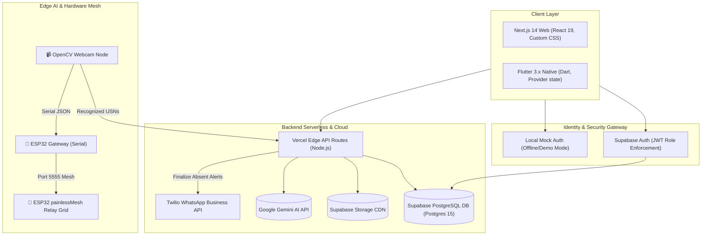

# 🏆 Connect & Prep: Final Round Pitch Deck
### *Pitching the Complete Project: Features, Deep-Dive Architecture & Security Hardening*

---

<!-- slide -->
## Slide 1: Title Slide
<p align="center">
  
</p>

# CONNECT & PREP
### *The Ultimate AI-Powered Academic Command Center & IoT Campus Grid*

---

<!-- slide -->
## Slide 2: Core Team Info
### **The Connect & Prep Development Team**

* **Team Name:** Team Connect & Prep
* **Profiles & Capabilities:**
  * **Full-Stack Developer & UI/UX Architect:** Focuses on Next.js 14 App Router, React 19, custom Vanilla CSS styling systems, database schema integrity, and Flutter mobile applications.
  * **IoT & Edge Systems Lead:** Coordinates Python OpenCV facial recognition, dlib HOG algorithms training, and ESP32 painlessMesh node communications.
  * **Cybersecurity Specialist:** Builds secure JWT auth gates, HttpOnly cookie systems, image EXIF metadata cleaners, and rate-limited cryptographic anonymizing feedback loops.
* **Core Philosophy:** Consolidating fragmented tools to save academic time, cut utility waste, and provide transparency while maintaining strict student privacy.

---

<!-- slide -->
## Slide 3: The Institutional Challenge & Problem Statement
### *The Fragmented Campus Crisis & Administrative Overhead*

Higher education institutions face severe administrative and academic inefficiencies due to fragmented legacy tools:
* **Academic Tool Fragmentation:** Students are forced to juggle multiple disjointed applications—using one for lecture slides, another for past exam papers, separate forums for doubts, manual cards for library borrowing, and distinct systems for canteens. This results in data silos and constant navigation friction, leading to a 73% drop in active coordination.
* **Attendance Fraud & Proxy Logs:** Traditional methods like calling registers waste up to 10% of lecture time. Newer digital solutions like static QR codes, Bluetooth beacons, or mobile check-ins are easily bypassed by students sharing codes or coordinates, resulting in inaccurate records.
* **Parental Disconnect & Safety Blindspots:** Parents have zero real-time visibility into whether their children safely arrived on campus, actively attended scheduled lectures, or kept up with CGPA trends until terminal grade cards arrive.
* **Teacher Administrative Burnout:** Faculty spend valuable hours manually compiling test papers, tracking student project steps, and cross-checking records, taking time away from direct student mentoring.

---

<!-- slide -->
## Slide 4: Unified Platform Topology & System Architecture
### *End-to-End Subsystem Integration*

Connect & Prep is designed as a hybrid platform that divides processes between lightweight clients, serverless APIs, cloud storage systems, and local edge computing units.



---

<!-- slide -->
## Slide 5: Technology Stack & Component Specifications
### *The Development Core*

Our codebase consists of a web administrative interface, a native mobile client, and a local edge computing mesh.

* **Frontend Web Framework:** Next.js 14 App Router, built using React 19 and styled with clean custom Vanilla CSS.
* **Mobile Client Framework:** Flutter 3.x (Dart 3) incorporating Provider state management and fl_charts.
* **Database & Auth:** Supabase PostgreSQL 15, managing real-time publications and Row-Level Security.
* **Edge Vision & IoT:** Python 3.10+, OpenCV, and dlib HOG models mapping face vectors to USNs. ESP32-WROOM-32D nodes driving relays via Wi-Fi mesh networks.
* **Integrations:** Google Gemini-1.5-Flash API for roadmaps and question generation, and Twilio Business APIs.
* **OpenJDK:** `17.0.19` (macOS) compiles Gradle build dependencies for Android APK outputs.

---

<!-- slide -->
## Slide 6: Role-Based Access Control (RBAC) Matrix
### *Gating Platform Actions at the Database Level*

Security is enforced at the database level by extracting the user's role claim directly from their JWT metadata during queries.

* **Claim-Based Authorization:** Every request contains a JSON Web Token verified by Supabase Auth, mapping queries to roles (`student`, `teacher`, `parent`, `admin`).
* **Granular Table Gating:** Row-Level Security (RLS) filters rows so users only interact with permitted resources:

| Feature Module | Student Capability | Teacher (Faculty) Capability | Parent Capability |
| :--- | :--- | :--- | :--- |
| **Dashboard Views** | View streaks, logs, pending tasks | View schedules, doubts, and reviews | View child GPA trends & gate pass alerts |
| **Doubt Solver** | Post doubts, comment, add tags | Review questions, answer doubts, resolve | View-only access to doubts |
| **Notes & PYQs** | View & download lecture PDFs | Upload notes, draft exam questions | View student academic materials |
| **Project Hub** | Register team, link GitHub, view remarks | Assign mentors, approve projects, write remarks | View project title and review status |
| **Assignment Hub** | Submit files, check deadlines | Create assignments, grade uploads | View upcoming deadlines & grades |
| **Safety Portal** | Trigger simulated NFC gate pings | View classroom check-ins | Real-time GPS/Gate dashboard |
| **Finance Portal** | View bills | N/A | Pay fees, view transaction history, download bills |

---

<!-- slide -->
## Slide 7: Database Schema Design - Core Tables & Entities
### *Core User, Profiles, and Doubts Tables*

The PostgreSQL schema is structured for relational integrity and role validation.

* **Users (`users`):** Stores platform credentials.
  * `id` `uuid` (Primary Key, matching `auth.users.id` directly for identity security).
  * `email` `varchar(255)` (Unique and validated).
  * `name` `varchar(255)` (Display name).
  * `role` `varchar(50)` (Constrained to `student`, `teacher`, `parent`, `admin`).
  * `usn` `varchar(50)` (Nullable student branch code, e.g., `4VV25EC001`).
* **Profiles (`profiles`):** Extends specific details for students.
  * `id` `uuid` (Primary Key, FK referencing `users.id` with cascading delete).
  * `class_section` `varchar(50)` (e.g., "Section A").
  * `parent_id` `uuid` (Self-referential FK pointing to the parent's profile record, enabling multi-child associations).
* **Doubts (`doubts`):**
  * `id` `uuid` PK, `author_id` FK to `profiles.id`, `category` string, `title` string, `question` text, `tags` string, `created_at` timestamp.
* **Replies (`replies`):**
  * `id` `uuid` PK, `doubt_id` FK to `doubts.id`, `author_id` FK to `profiles.id`, `content` text, `created_at` timestamp.

---

<!-- slide -->
## Slide 8: Database Schema Design - Projects, Assignments & Timetables
### *Academic Projects & Classroom Timetable Tables*

* **Projects (`projects`):** Coordinates student team projects and mentor reviews.
  * `id` `uuid` (Primary Key).
  * `title` `varchar(255)` (Name of the project).
  * `description` `text` (Scope and features details).
  * `github_url` `varchar(255)` (Linked repository for status tracking).
  * `mentor_name` `varchar(150)` (Assigned faculty advisor).
  * `status` `varchar(30)` (`Initiated`, `Under Review`, `Approved`).
  * `remarks` `text` (Feedback notes from the teacher).
* **Project Members (`project_members`):** Resolves many-to-many relationships.
  * `project_id` `uuid` (FK to `projects.id`).
  * `usn` `varchar(50)` (FK to `profiles.usn`).
* **Assignments (`assignments`):**
  * `id` `uuid` PK, `subject` string, `title` string, `deadline` timestamp, `grade_received` string, `status` string (`Pending`, `Submitted`, `Graded`).
* **Timetables (`timetables`):**
  * `id` `uuid` PK, `subject` string, `day` string, `time` string, `room` string. Used to correlate camera logs with active classes.

---

<!-- slide -->
## Slide 9: Database Schema Design - Attendance snaps, Wallets & Feedbacks
### *Real-Time Attendance, Wallets, & Feedback Tables*

* **Attendance Snapshots (`attendance_snapshots`):**
  * `snapshot_id` `uuid` (Primary Key).
  * `slot_id` `uuid` (FK to `timetables.id`).
  * `check_number` `integer` (Index representing which random check out of 5 was executed).
  * `detected_students` `uuid[]` (Array of detected student IDs).
* **Attendance Session Ledger (`attendance_session_ledger`):**
  * `ledger_id` PK, `student_id` FK to `users.id`, `slot_id` FK to `timetables.id`, `session_date` date, `detected_count` integer (0-5 scale), `total_checks` integer (default 5), `final_status` string (`PRESENT`, `LATE`, `ABSENT`), `is_finalised_by_teacher` boolean.
* **Wallet (`wallet`):**
  * `id` `uuid` PK, `user_id` FK to `users.id` (Unique, prevents multiple wallets per user), `balance` numeric, `upi_id` string.
* **Wallet Transactions (`wallet_transactions`):**
  * `id` PK, `wallet_id` FK to `wallet.id`, `type` string (`recharge`, `checkout`), `amount` numeric, `status` string.
* **Feedbacks (`feedbacks`):**
  * `id` `uuid` PK, `category` string, `content` text, `daily_hash` string.

---

<!-- slide -->
## Slide 10: Database Security & Row-Level Security (RLS) Policies
### *Zero-Trust Database Gating*

Supabase enforces strict isolation limits at the database engine level, ensuring database transactions are secure even if the API server layer is compromised:

* **Users Isolation:** Authenticated profiles can select display names but update permissions require validation against matching user IDs:
  ```sql
  CREATE POLICY "Allow users to update own profiles"
  ON users FOR UPDATE
  USING (auth.uid() = id);
  ```
* **Wallet Access Isolation:** Balance records are guarded. Only the matching user has permissions to fetch their wallet data:
  ```sql
  CREATE POLICY "Allow students to view own balance"
  ON wallet FOR SELECT
  USING (user_id = auth.uid());
  ```
* **Attendance RLS Isolation:** Students hold read-only permissions for their own logs. Teachers can edit records:
  ```sql
  CREATE POLICY "Allow teachers write access to attendance"
  ON attendance_session_ledger FOR ALL
  USING (auth.jwt() ->> 'role' = 'teacher');
  ```

---

<!-- slide -->
## Slide 11: Subsystem Sequence Flows
### *Doubt Solver Roster & Gate Safety Pipelines*

Our subsystems communicate in real time, coordinating operations across databases, edge controllers, and notifications:

* **Academic Doubt Solver Flow:**
  * **Sequence:** Student uploads Doubt payload $\rightarrow$ PostgreSQL logs entry $\rightarrow$ realtime channel pushes metadata hook to Teacher console $\rightarrow$ Teacher responds with solution payload $\rightarrow$ state updates to Answered $\rightarrow$ Student resolves thread.
* **Campus Entry GPS/NFC Gateway Flow:**
  * **Sequence:** Student pings card reader or triggers geofenced arrival at Entrance Gate $\rightarrow$ reader API issues POST to edge route $\rightarrow$ database logs gate check-in event (gate ID, timestamp) $\rightarrow$ realtime listener pushes notifications to parent dashboard.

---

<!-- slide -->
## Slide 12: Core AI Module - Prepcare AI Study Advisor
### *Gemini 1.5 prompt details & dynamic inputs*

The Prepcare module operates inside a Next.js serverless route, utilizing `gemini-1.5-flash` to construct study schedules.

* **Data Inputs:** Student's cumulative CGPA, active study streaks, targeted final score, exam date, and course syllabus text.
* **Prompt Instructions:**
  ```text
  You are Prepcare, an advanced academic mentor.
  Given a student's CGPA, subject list, and target score, formulate:
  1. A checklist of 3 actionable study items.
  2. A target schedule broken down by modules.
  3. Encouraging, metrics-focused guidance.
  Format your response cleanly in Markdown.
  ```
* **Dashboard Output:** Delivered directly to the client dashboard as a parsed Markdown checklist, providing students with structured study milestones.

---

<!-- slide -->
## Slide 13: Core AI Module - Smart Question Paper Generator
### *Faculty test wizard mapping to Bloom's Taxonomy*

Faculty can construct custom examination papers in 1-click by configuring cognitive metrics directly in the admin portal:

* **Cognitive Level Configurations:** Faculty set weights across Bloom's Taxonomy levels (Remembering, Understanding, Applying, Analyzing, Evaluating, Creating) using dashboard input sliders.
* **Input Parameters:** Course code (e.g. "Digital Signal Processing"), exam length, marks weightage, target difficulty, and syllabus chapters.
* **Generation Engine:** The form posts payload arguments to `/api/paper-generator/generate`. The edge server formats arguments into prompt structures, requests structured JSON from Gemini, and returns a styled question paper.

---

<!-- slide -->
## Slide 14: Core AI Module - Automated Doubt Tagging & Resolving
### *Vector search & draft responses*

To reduce teacher workloads, doubts are analyzed by AI on-the-fly:

* **Automated Tagging:** When a student submits a question, the backend triggers Gemini to extract key concept tags (e.g., `["indexing", "database", "trees"]`) and inserts them into the doubt record.
* **Vector Note References:** The engine runs semantic searches against the notes database using cosine similarity, appending links to relevant notes to the student's question.
* **Tutor Draft Responses:** Gemini drafts an AI solution instantly, giving students immediate answers while waiting for faculty verification.

---

<!-- slide -->
## Slide 15: OpenCV Face-Recognition Telemetry Pipeline
### *dlib HOG face landmarks extraction*

The core attendance engine runs on edge devices, extracting facial landmarks to verify student USNs.

* **HOG Feature Detection:** Converts camera frames to HOG (Histogram of Oriented Gradients) encodings using `train_model.py` and compiles them to `trainer/encodings.pickle`.
* **Low-Latency Edge Processing:** Edge feeds scale images down to $0.25\times$ resolution to reduce processing overhead, verifying faces using dlib HOG structures.
* **Accuracy Metrics:**
  $$\text{Accuracy (\%)} = \max\left(0, (1.0 - \text{face\_distance}) \times 100\right)$$
* **USN Translation Mapping:** Compares face distances against a strict `tolerance = 0.5` configuration. Matches translate directly to student USNs (e.g., `bharath` $\rightarrow$ `032`).

---

<!-- slide -->
## Slide 16: Roster Verification Sequence (5-Checkpoint Scan)
### *Lecture attendance validation*

Instead of a single check, Connect & Prep runs a **randomized 5-checkpoint check sequence** during a scheduled lecture.

* **Randomized Checks:** The python randomizer process schedules 5 checks within 90% of the lecture duration, preventing proxy checks.
* **LED Mesh Coordination:** Checkpoints trigger physical LED updates via mesh connections to notify students of active scanning.
* **Roster finalisation rules:** Ledger matches confidence ratios:
  * **PRESENT:** Student detected in $\geq 4$ out of 5 checks.
  * **LATE:** Student detected in $1 - 3$ checks.
  * **ABSENT:** Student detected in $0$ checks.

```
Start lecture ─────────► [Random Checks 1...5] ─────────► Lock roster
                           (Python Webcam scans)          ├─► Present (>= 4)
                                                          ├─► Late (1-3)
                                                          └─► Absent (0)
```

---

<!-- slide -->
## Slide 17: IoT painlessMesh Quadrant occupancy Control
### *Classroom utility automation*

Connect & Prep integrates active campus utility tracking with energy-efficient hardware control.

* **Quadrant Mapping:** During validation cycles, the camera script analyzes the room space as a $2\times2$ matrix: Quadrants Q1, Q2, Q3, and Q4.
* **Serial Telemetry broadcast:** When students are present in a sector, the camera script dispatches a Serial JSON payload to the ESP32 Gateway Node:
  ```json
  {"quads": {"Q1": 0, "Q2": 1, "Q3": 1, "Q4": 0}}
  ```
  *(0 represents Active occupancy/Relay ON; 1 represents Empty/Relay OFF)*
* **Wireless painlessMesh Networking:** The ESP32 Gateway Node switches its physical GPIO relay pins and broadcasts this configuration over local Wi-Fi nodes using `painlessMesh` on Port `5555`. Remote nodes automatically trigger relays, turning off lights in empty quadrants to cut power waste.

---

<!-- slide -->
## Slide 18: Campus Safety, Twilio Alerts & RFID Wallets
### *Entrance Alerts & Financial ledgers*

* **Entrance Gate check-ins:** Students ping NFC tags or trigger GPS beacons at college entrances. The scanner logs check-ins instantly to Supabase.
* **Automated Twilio WhatsApp Alerts:** Once a teacher locks an attendance session, the backend filters students marked `ABSENT` and issues automated WhatsApp warnings directly to parents.
* **Excuse Portal:** Absent students submit excuses and upload documentation directly.
* **RFID Campus Wallet:** Students use virtual wallets for print shops, canteen purchases, and bookstore checkouts. updates balances via SQL triggers when transaction checkouts are logged.
* **Digital Library Integration:** Displays available books, tracks check-out periods, and triggers notifications on late returns.

---

<!-- slide -->
## Slide 19: Zero-Trust Security, DPDP Act & System Resilience
### *Decoupled Feedbacks, EXIF Cleaners & Outage Failovers*

Our platform is hardened against top web threats and complies with India's DPDP Act 2023:

* **Anonymized Feedback Loop (HMAC Decoupling):** Feedback forms do not log user IDs. Instead, a daily cryptographic HMAC hash is computed:
  $$\text{Hash} = \text{HMAC-SHA256}(\text{UserID}, \text{DailySalt})$$
  This limits users to 3 feedback posts daily without leaving any link to user identities in the database.
* **Session Protections:** Disables localStorage token storage, using secure HttpOnly, SameSite=Strict cookies to block XSS hijacking.
* **File Upload Protections:** Verifies uploads using server-side magic byte signatures, strips image EXIF metadata (clearing GPS tags), and serves files via 15-minute expiring signed CDN links.
* **Outage Resiliences:** Uses local JSON storage redundancy (`live_snapshots.json` & `live_ledger.json`) when Supabase is unreachable. Triggers mock session payloads dynamically using dummy credentials (e.g. Student `1/1`, Teacher `2/2`, Parent `3/3`).

---

<!-- slide -->
## Slide 20: Thank You Slide
# THANK YOU
### *Connect & Prep: Fostering the Future of Collaborative Learning*

* **Status:** Complete working prototype presented for the first time.
* **Q&A Session:** Open for questions, feedback, and demonstration inquiries.
