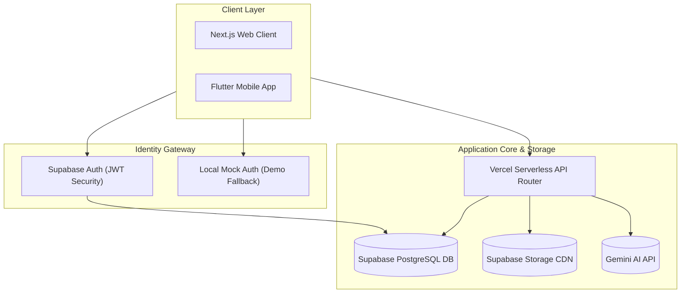

# 🗺️ Connect & Prep: Initial Round Pitch Deck
### *Applying for the Hackathon: Idea Submission, Proposed Architecture & BMC Canvas*

---

<!-- slide -->
## Slide 1: Title Slide
<p align="center">
  
</p>

# CONNECT & PREP
### *Master the Academic Nexus with AI-Powered Intelligence*

---

<!-- slide -->
## Slide 2: Core Team Info
### **The Connect & Prep Development Team**

* **Team Name:** Team Connect & Prep
* **Profiles & Capabilities:**
  * **Full-Stack Developer & UI/UX Architect:** Focuses on Next.js 14 App Router, React 19, custom Vanilla CSS styling systems, database schema integrity, and Flutter mobile applications.
  * **IoT & Edge Systems Lead:** Coordinates Python OpenCV facial recognition, dlib HOG algorithms training, and ESP32 painlessMesh node communications.
  * **Cybersecurity Specialist:** Builds secure JWT auth gates, HttpOnly cookie systems, image EXIF metadata cleaners, and rate-limited cryptographic anonymizing feedback loops.
* **Core Philosophy:** Consolidating fragmented tools to save academic time, cut utility waste, and provide transparency while maintaining strict student privacy.

---

<!-- slide -->
## Slide 3: The Core Problem Statement & Friction Points
### *The Fragmented Campus Crisis & Administrative Overhead*

Higher education institutions face severe administrative and academic inefficiencies due to fragmented legacy tools:
* **Academic Tool Fragmentation:** Students are forced to juggle multiple disjointed applications—using one for lecture notes, another for past papers, separate forums for doubts, manual cards for library books, and canteen registers. This results in data silos and navigation friction.
* **Attendance Fraud & Proxy Logs:** Traditional roll calls waste 10% of lecture time. Digital QR codes or bluetooth pings are easily bypassed by students sharing credentials or coordinates, resulting in proxy fraud.
* **Parental Disconnect & Safety Blindspots:** Parents have zero real-time visibility into whether their children safely arrived on campus, actively attended classes, or kept up with CGPA trends.
* **Teacher Administrative Burnout:** Faculty spend valuable hours manually compiling test papers, tracking student projects, and crosschecking rosters, leaving less time for mentoring.

---

<!-- slide -->
## Slide 4: Unified Platforms Architecture
### *E2E Subsystem Integration Plan*

Connect & Prep is designed as a hybrid platform dividing tasks between lightweight clients, serverless edge APIs, cloud databases, and local edge hardware.



---

<!-- slide -->
## Slide 5: Tech Stack Plan
### *Proposed Component & Version Specifications*

Our core technologies are selected for maximum performance, edge scaling capability, and secure integrations:

* **Web portal:** Next.js 14 App Router (React 19) styled with clean custom Vanilla CSS.
* **Mobile application:** Flutter SDK (Dart 3) running Provider state management and fl_charts.
* **Backend Database:** Supabase PostgreSQL 15, handling authentication, relational triggers, and database Row-Level Security.
* **AI Processing:** Google Gemini-1.5-Flash API for Prepcare roadmaps and exam generation endpoints.
* **Edge telemetry:** Python 3 OpenCV and dlib HOG face landmarks extraction, and ESP32 nodes running painlessMesh over Port 5555.
* **Integrations:** Twilio APIs for real-time WhatsApp parent alerts.
* **JDK Environment:** OpenJDK `17.0.19` (macOS) running Gradle compilers for native builds.

---

<!-- slide -->
## Slide 6: Proposed Role-Based Access Control (RBAC) Matrix
### *Securing Access Pathways at the Database Level*

Users are assigned structural roles inside Supabase user metadata, enforcing access permissions directly inside relational tables:

| Feature Module | Student Capability | Teacher (Faculty) Capability | Parent Capability |
| :--- | :--- | :--- | :--- |
| **Dashboard Views** | View streaks, logs, pending tasks | View schedules, doubts, and reviews | View child GPA trends & gate pass alerts |
| **Doubt Solver** | Post doubts, comment, add tags | Review questions, answer doubts, resolve | View-only access to academic doubts |
| **Notes & PYQs** | View & download lecture PDFs | Upload notes, draft exam questions | View student academic materials |
| **Project Hub** | Register team, link GitHub, view remarks | Assign mentors, approve projects, write remarks | View project title and review status |
| **Assignment Hub** | Submit files, check deadlines | Create assignments, grade uploads | View upcoming deadlines & grades |
| **Safety Portal** | Trigger simulated NFC gate pings | View classroom check-ins | Real-time GPS/Gate dashboard |
| **Finance Portal** | View bills | N/A | Pay fees, view transactions, download bills |

---

<!-- slide -->
## Slide 7: Database Schema (Part 1 - Users, Profiles, Doubts & Replies)
### *Core Relational Entities*

The PostgreSQL schema is structured for relational integrity and role validation.

* **Users (`users`):** Stores platform credentials.
  * `id` `uuid` (Primary Key, matching `auth.users.id` directly for identity security).
  * `email` `varchar(255)` (Unique and validated).
  * `name` `varchar(255)` (Display name).
  * `role` `varchar(50)` (Constrained to `student`, `teacher`, `parent`, `admin`).
  * `usn` `varchar(50)` (Nullable student branch code, e.g., `4VV25EC001`).
* **Profiles (`profiles`):** Extends specific details for students.
  * `id` `uuid` (Primary Key, FK referencing `users.id` with cascading delete).
  * `class_section` `varchar(50)` (Section name).
  * `parent_id` `uuid` (Self-referential FK pointing to parent's profile).
* **Doubts (`doubts`):**
  * `id` `uuid` PK, `author_id` FK, `category` string, `title` string, `question` text, `tags` string, `created_at` timestamp.
* **Replies (`replies`):**
  * `id` `uuid` PK, `doubt_id` FK to `doubts.id`, `author_id` FK, `content` text.

---

<!-- slide -->
## Slide 8: Database Schema (Part 2 - Projects, Assignments & Timetables)
### *Academic tracking Tables*

* **Projects (`projects`):** Coordinates student team projects and mentor reviews.
  * `id` `uuid` (Primary Key).
  * `title` `varchar(255)` (Name of the project).
  * `description` `text` (Scope and features details).
  * `github_url` `varchar(255)` (Linked repository for status tracking).
  * `mentor_name` `varchar(150)` (Assigned faculty advisor).
  * `status` `varchar(30)` (`Initiated`, `Under Review`, `Approved`).
  * `remarks` `text` (Feedback notes from the teacher).
* **Project Members (`project_members`):** Resolves many-to-many relationships.
  * `project_id` `uuid` (FK to `projects.id`).
  * `usn` `varchar(50)` (FK to `profiles.usn`).
* **Assignments (`assignments`):**
  * `id` `uuid` PK, `subject` string, `title` string, `deadline` timestamp, `grade_received` string, `status` string (`Pending`, `Submitted`, `Graded`).
* **Timetables (`timetables`):**
  * `id` `uuid` PK, `subject` string, `day` string, `time` string, `room` string. Used to correlate camera logs with active classes.

---

<!-- slide -->
## Slide 9: Database Schema (Part 3 - Snapshots, Ledgers, Wallets & Feedbacks)
### *Campus utilities Tables*

* **Attendance Snapshots (`attendance_snapshots`):**
  * `snapshot_id` `uuid` (Primary Key).
  * `slot_id` `uuid` (FK to `timetables.id`).
  * `check_number` `integer` (Index representing which random check out of 5 was executed).
  * `detected_students` `uuid[]` (Array of detected student IDs).
* **Attendance Session Ledger (`attendance_session_ledger`):**
  * `ledger_id` PK, `student_id` FK to `users.id`, `slot_id` FK to `timetables.id`, `session_date` date, `detected_count` integer (0-5 scale), `total_checks` integer (default 5), `final_status` string (`PRESENT`, `LATE`, `ABSENT`), `is_finalised_by_teacher` boolean.
* **Wallet (`wallet`):**
  * `id` `uuid` PK, `user_id` FK to `users.id` (Unique, prevents multiple wallets per user), `balance` numeric, `upi_id` string.
* **Wallet Transactions (`wallet_transactions`):**
  * `id` PK, `wallet_id` FK to `wallet.id`, `type` string (`recharge`, `checkout`), `amount` numeric, `status` string.
* **Feedbacks (`feedbacks`):**
  * `id` `uuid` PK, `category` string, `content` text, `daily_hash` string.

---

<!-- slide -->
## Slide 10: Proposed Row-Level Security (RLS) Database Isolation
### *Zero-Trust Database Gating Plan*

Supabase enforces strict isolation limits at the database engine level, ensuring database transactions are secure even if the API server layer is compromised:

* **Users Isolation:** Authenticated profiles can select display names but update permissions require validation against matching user IDs:
  ```sql
  CREATE POLICY "Allow users to update own profiles"
  ON users FOR UPDATE
  USING (auth.uid() = id);
  ```
* **Wallet Access Isolation:** Balance records are guarded. Only the matching user has permissions to fetch their wallet data:
  ```sql
  CREATE POLICY "Allow students to view own balance"
  ON wallet FOR SELECT
  USING (user_id = auth.uid());
  ```
* **Attendance RLS Isolation:** Students hold read-only permissions for their own logs. Teachers can edit records:
  ```sql
  CREATE POLICY "Allow teachers write access to attendance"
  ON attendance_session_ledger FOR ALL
  USING (auth.jwt() ->> 'role' = 'teacher');
  ```

---

<!-- slide -->
## Slide 11: Academic Command Center Core
### *Smart Study Notes & PYQ Vault (Status: Built & Operational)*

Our core academic hub is fully implemented to remove resource friction:
* **Verified Lecture Notes:** Instructors upload lecture notes directly to the platform, categorized by semester and subject branch.
* **CDN Access:** Files are hosted on secure Supabase CDN buckets, enabling lightning-fast downloads on mobile and web clients.
* **Question Vault:** Direct catalog of past university question papers (PYQs) so students can benchmark their preparation.
* **Dashboard Streaks:** Visual display tracking student login streaks and study hours.

---

<!-- slide -->
## Slide 12: Peer Collaboration Node
### *Doubt Resolving & Study Marathons (Status: Built & Operational)*

Providing real-time collaboration channels to replace fragmented WhatsApp groups:
* **Interactive Doubt Resolver:** Students post text/code blocks. Peers or faculty respond with solutions. The student can click "Accept Solution" to resolve the thread.
* **Group Study Marathons:** Live deep-work focus rooms where students study together and track cumulative hours.
* **P2P Tutoring Bridge:** Connecting struggling students with senior mentors who excel in specific subjects.

---

<!-- slide -->
## Slide 13: Edge AI Face-Recognition Attendance
### *OpenCV & dlib HOG Pipeline (Status: Planned/WIP)*

We are actively constructing an Edge AI camera pipeline to automate lecture rosters:
* **OpenCV Captures:** Captures frames from the classroom webcam during lectures.
* **dlib HOG Facial landmark recognition:** Translates faces to landmarks and compares them to `trainer/encodings.pickle` with strict tolerance criteria.
* **Accuracy calculation plan:** Enforces threshold margins to detect matches.
* **Randomized Checks:** The system will schedule 5 random validation checks during a lecture slot to prevent student proxies.

---

<!-- slide -->
## Slide 14: IoT painlessMesh Occupancy Control
### *Classroom Lighting Grids (Status: Planned/WIP)*

We are building a smart grid to automate classrooms:
* **Quadrant Tracking coordinates:** Splitting the camera viewport into 4 zones (Q1, Q2, Q3, Q4).
* **painlessMesh Wi-Fi Protocol:** Edge cameras serialise occupancy statuses to an ESP32 gateway.
* **Relay toggles:** The gateway broadcasts relay commands over Port 5555. Remote ESP32 mesh nodes automatically switch off lights and fans in empty quadrants.

---

<!-- slide -->
## Slide 15: Safety GPS, Twilio Alerts & RFID Wallets
### *Gate Passes, Parent alerts & RFID transactions (Status: Planned/WIP)*

* **NFC Gate Passes:** NFC cards or GPS geofences log entrance check-ins to Supabase.
* **Twilio WhatsApp Dispatch:** Backend filters students marked `ABSENT` on roster locks and dispatches warnings to parents via Twilio WhatsApp API.
* **RFID Campus Wallets:** Coordinates cafeteria and print shop micro-recharges, automatically updating database balances using database triggers.
* **Library Integration:** Digital book inventory logs tracking checkout periods.

---

<!-- slide -->
## Slide 16: BMC: Key Partners & Key Resources
### *Core Foundations & Alliances*

* **Key Partners:**
  * **Universities & Colleges:** Provide pilot groups and student information databases.
  * **IoT component providers:** Bulk supplies of ESP32-WROOM chips, relays, and OpenCV-supported cameras.
  * **SaaS Hosting:** Utilizing Supabase (relational engine) and Vercel (edge deployments).
* **Key Resources:**
  * **Algorithm Pipelines:** Pre-trained HOG model arrays and Google Gemini prompt licenses.
  * **Intellectual Property:** Secure JWT authentication gates, decoupled complaint algorithms, and proprietary database schemas.

---

<!-- slide -->
## Slide 17: BMC: Key Activities & Value Propositions
### *Operations & Offerings*

* **Key Activities:**
  * **Model Training:** Refining dlib face recognition models on student datasets.
  * **Platform Updates:** Maintaining security patches and optimizing Vercel serverless functions.
  * **Security Auditing:** Conducting weekly checks on Supabase Row-Level Security configuration.
* **Value Propositions:**
  * **Students:** Personal roadmap guides, RFID wallets, and direct peer doubt solvers.
  * **Teachers:** Automated question generation, zero-proxy rosters.
  * **Parents:** Real-time WhatsApp safety status logs.

---

<!-- slide -->
## Slide 18: BMC: Customer Segments, Channels & Relationships
### *Access Points & Audience*

* **Customer Segments:**
  * **Institutional Clients:** Tier-1/2 universities looking to replace disconnected admin tools.
  * **Secondary Target:** Private training institutes and boarding academies.
* **Channels:**
  * Next.js web application for administrative staff.
  * Flutter mobile app for on-the-go student and parent updates.
* **Customer Relationships:**
  * Dedicated onboarding support.
  * Automated notifications keeping parents directly engaged in safety protocols.

---

<!-- slide -->
## Slide 19: BMC: Cost Structure & Revenue Streams
### *Project Economics*

* **Cost Structure:**
  * **SaaS compute:** Supabase PostgreSQL queries and Vercel edge runtime processing.
  * **AI prompt costs:** Token pricing on Gemini API roadmaps and question generation requests.
  * **Edge node deployments:** Manufacturing and installing ESP32 motion quadrant grids and gate scanners.
* **Revenue Streams:**
  * **Institutional Licensing:** Charged per student per year.
  * **Micro-Transactions:** Micro-fee on transaction charges within the campus wallet checkout ecosystem.

---

<!-- slide -->
## Slide 20: Thank You Slide
# THANK YOU
### *Connect & Prep: Fostering the Future of Collaborative Learning*

* **Status:** Complete working prototype presented for the first time.
* **Q&A Session:** Open for questions, feedback, and demonstration inquiries.
