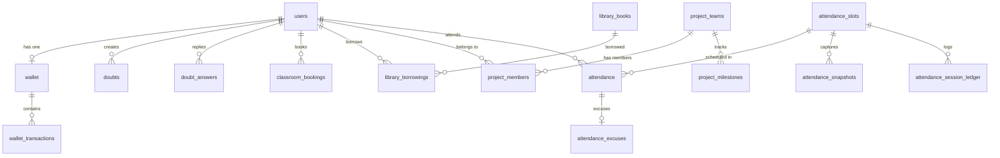

# Database Schema & SQL Specification

This document provides the complete structural specification of the **Supabase PostgreSQL database** supporting the Connect & Prep platform. It details all tables, relationships, data types, Row-Level Security (RLS) policies, and custom utility functions.

---

## 1. Core Entity Relationship Diagram (ERD)

---

## 2. Table Schemas

### 2.1 Users (`users`)
Stores verified platform identities across all application portals.
*   **`id`** `uuid` (Primary Key, matches `auth.users.id`)
*   **`email`** `varchar(255)` (Unique, validated)
*   **`name`** `varchar(255)` (Display name)
*   **`role`** `varchar(50)` (ENUM values: `student`, `teacher`, `parent`, `admin`, `advisor`)
*   **`usn`** `varchar(50)` (Nullable, Student identifier)
*   **`created_at`** `timestamp` (Default: `now()`)

### 2.2 Attendance (`attendance`)
Stores lesson-level attendance checks.
*   **`id`** `uuid` (Primary Key)
*   **`student_id`** `uuid` (Foreign Key -> `users.id`)
*   **`date`** `date` (Check-in date)
*   **`status`** `varchar(20)` (`present`, `absent`, `excused`)
*   **`slot_id`** `uuid` (Foreign Key -> `attendance_slots.id`)
*   **`verified_by`** `uuid` (Foreign Key -> `users.id`, nullable)
*   **`is_random_checked`** `boolean` (Default: `false`)

### 2.3 Attendance Slots (`attendance_slots`)
Stores timetable slot allocations for sessions.
*   **`id`** `uuid` (Primary Key)
*   **`name`** `varchar(100)` (e.g., "Maths 101 Lecture")
*   **`start_time`** `time`
*   **`end_time`** `time`
*   **`created_by`** `uuid` (Foreign Key -> `users.id`)

### 2.4 Attendance Snapshots (`attendance_snapshots`)
Stores camera snapshots for AI face-recognition batch attendance.
*   **`id`** `uuid` (Primary Key)
*   **`slot_id`** `uuid` (Foreign Key -> `attendance_slots.id`)
*   **`snapshot_url`** `text` (Points to Supabase Storage CDN)
*   **`face_count`** `integer`
*   **`created_at`** `timestamp`

### 2.5 Attendance Session Ledger (`attendance_session_ledger`)
Detailed confidence matrix matching logs for verification.
*   **`id`** `uuid` (Primary Key)
*   **`slot_id`** `uuid` (Foreign Key -> `attendance_slots.id`)
*   **`student_id`** `uuid` (Foreign Key -> `users.id`)
*   **`matched_at`** `timestamp`
*   **`confidence_score`** `numeric` (Percentage confidence from AI parser)

### 2.6 Attendance Excuses (`attendance_excuses`)
Students log check files and notes to justify absent marks.
*   **`id`** `uuid` (Primary Key)
*   **`attendance_id`** `uuid` (Foreign Key -> `attendance.id`)
*   **`reason`** `text`
*   **`file_url`** `text` (Points to Supabase Storage)
*   **`status`** `varchar(20)` (`pending`, `approved`, `rejected`)
*   **`submitted_at`** `timestamp`
*   **`reviewed_by`** `uuid` (Foreign Key -> `users.id`, nullable)

### 2.7 Wallet (`wallet`)
Student campus RFID wallets.
*   **`id`** `uuid` (Primary Key)
*   **`user_id`** `uuid` (Foreign Key -> `users.id`, Unique)
*   **`balance`** `numeric(10,2)` (Default: `0.00`)
*   **`upi_id`** `varchar(100)`
*   **`updated_at`** `timestamp`

### 2.8 Wallet Transactions (`wallet_transactions`)
Ledger of all digital deposits and campus purchases.
*   **`id`** `uuid` (Primary Key)
*   **`wallet_id`** `uuid` (Foreign Key -> `wallet.id`)
*   **`type`** `varchar(20)` (`recharge`, `checkout`, `withdrawal`)
*   **`amount`** `numeric(10,2)`
*   **`status`** `varchar(20)` (`pending`, `completed`, `failed`)
*   **`reference_id`** `varchar(255)`
*   **`created_at`** `timestamp`

### 2.9 Project Teams (`project_teams`)
Stores academic project details.
*   **`id`** `uuid` (Primary Key)
*   **`name`** `varchar(150)`
*   **`project_title`** `varchar(255)`
*   **`github_repo`** `varchar(255)`
*   **`mentor_id`** `uuid` (Foreign Key -> `users.id`)
*   **`status`** `varchar(30)` (`draft`, `approved`, `reviewing`, `completed`)

---

## 3. Row-Level Security (RLS) Policies

Supabase enforces strict isolation limits:

1.  **`users` Isolation**:
    *   Any authenticated profile can read display names (`SELECT`).
    *   Only the authenticated user themselves can update their details (`UPDATE`).
2.  **`wallet` Access Control**:
    *   Students can view only their own balance.
    *   Parents can view balances linked to their registered student USN.
3.  **`attendance` Policies**:
    *   Students can read only their own attendance ledger.
    *   Faculty can insert, update, and verify attendance records.
    *   Parents can read attendance of matching student links.
4.  **`doubts` Policy**:
    *   All signed-in profiles can read details and contribute comments.
    *   Only authors can delete or edit their doubts.
