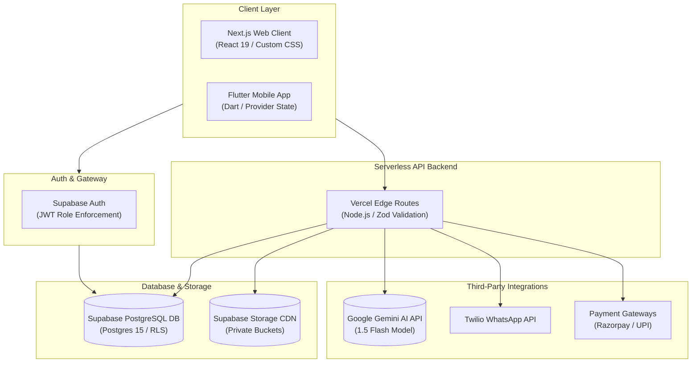

# 🏛️ System Architecture

**Connect & Prep** is a unified academic platform designed for high performance, real-time sync, and compliance with modern privacy standards.

---

## 🗺️ Architectural Topology

---

## 🧩 E2E Layer Specifications

### 1. Client Layer
*   **Web Client:** Built with **Next.js** (App Router) and **React 19**, styled using custom Vanilla CSS. Serves administrative, teacher, student, and parent dashboard panels.
*   **Mobile Client:** Built with **Flutter (Dart)** using the `provider` state manager to fetch and display calendars, checklists, and grades in a native wrapper.

### 2. Identity & Security Gateway
*   **Supabase Auth:** Validates user identity and passes role claims (`student`, `teacher`, `parent`, `admin`) inside JSON Web Tokens (JWT).
*   **Input Filter:** Serverless routes run strict **Zod** schema validations and recursively sanitize inputs before database operations.

### 3. Serverless Backend
*   **Vercel Edge Routes:** Houses dynamic, lightweight API microservices (Node.js/TypeScript) for file operations, AI prompts, and payment verification.

### 4. Database & Storage Layer
*   **Supabase PostgreSQL:** Executes RLS (Row-Level Security) policies at the database engine level to keep student records, wallets, and feedback isolated.
*   **Supabase Storage CDN:** Serves academic notes and assignment files via short-lived (15-min) secure signed URLs.

### 5. Integration Ecosystem
*   **Google Gemini 1.5 Flash:** Powers automated study plan generators, exam test papers (Bloom's Taxonomy), and doubt tags.
*   **Twilio Business API:** Automatically messages parents when a student check-in is flagged as absent.
*   **Razorpay / UPI:** Coordinates secure wallet replenishment transactions.
