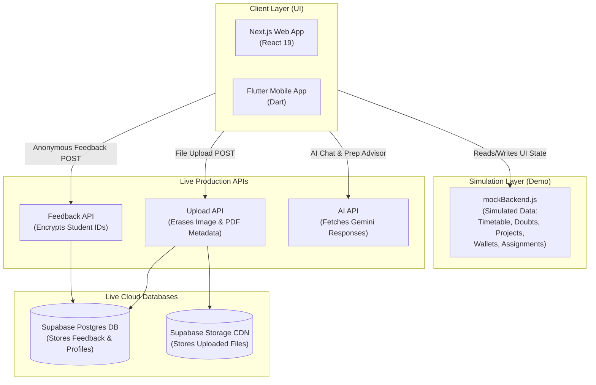

# 🏛️ Connect & Prep: System Architecture

Connect & Prep is designed as a **Demo-First Hybrid Architecture**. Most features run on simulated data for smooth presentations, while key security and AI actions route to live servers.

---

## 🗺️ System Topology

---

## 🧩 How the Layers Work

### 1. Simulated Demo Features (Mock System)
To ensure the app is fast and works offline during demos, these features use a simulated backend file ([mockBackend.js](file:///Users/bharathkumara/Desktop/PROJECTS/one-campus/src/services/mockBackend.js)):
*   **Classroom & Library Booking:** Simulates booking study rooms and checking out library books.
*   **Grades & CGPA Calculator:** Displays visual charts of GPA trends using dummy data.
*   **Discussion Forums:** Interactive doubt solving boards where users can post mock answers.
*   **Student Projects & Wallets:** Simulates linking GitHub repositories and using fake digital money to purchase canteen food.

### 2. Live Cloud Features (Real Backend)
These critical features connect directly to real servers and cloud databases:
*   **User Login Sync:** Synchronizes and verifies user accounts against the real Supabase Auth server.
*   **Anonymous Feedback Loop:** Scrambles student IDs into code using a hash key (HMAC-SHA256) so students can post reviews anonymously without saving their names or IPs.
*   **Metadata Stripping Upload Gate:** Erases hidden details (like GPS location tags from photos and author names from PDFs) using code libraries before saving them to cloud storage.
*   **AI Mentorship:** Sends inputs to Google's Gemini AI to generate custom study plans and schedules.