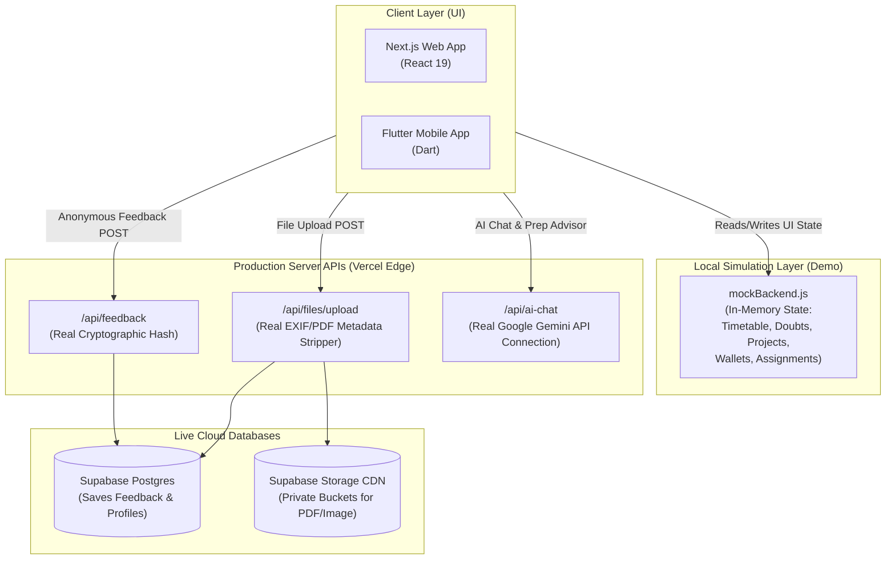

# 🏛️ Connect & Prep: System Architecture

Connect & Prep is designed as a **Demo-First Hybrid Architecture**. Most frontend interactions run on local mock data stores for smooth offline demonstrations, while key security-critical actions route to live production APIs.

---

## 🗺️ System Topology

---

## 🧩 E2E Layer Specifications

### 1. Interactive Demo Layer (Mock System)
To ensure lag-free presentations and offline capability, the following modules are fully interactive on the client side using [mockBackend.js](file:///Users/bharathkumara/Desktop/PROJECTS/one-campus/src/services/mockBackend.js):
*   **Classroom & Library Booking:** Simulates reservations, book checkouts, and room allocations.
*   **Grade Terminal & CGPA Calculator:** Renders mock charts of GPA trends dynamically.
*   **Social & Forums:** Interactive doubt solver UI and student discussion boards.
*   **Student Projects & Wallets:** Simulates GitHub linkages and campus card balances.

### 2. Live Production Features (Real Backend)
The following features route to live APIs and communicate with production servers:
*   **Authentication Sync:** Validates session state against the real Supabase Auth server.
*   **Anonymous Feedback Loop:** Runs server-side HMAC-SHA256 encryption on student IDs and logs anonymous responses directly to a live PostgreSQL table.
*   **Metadata Stripping Upload Gate:** Uploaded images and documents are processed by server-side libraries (`sharp` and `pdf-lib`) to erase GPS coordinates, device footprints, and PDF authors before uploading to a live private Supabase Storage bucket.
*   **AI Mentorship:** Sends live prompts to the Google Gemini API to return structured learning guides.